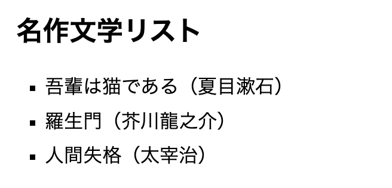

# jsQuiz-neo-05

「ES Modules の `export` / `import` で別ファイルからデータを読み込む」の振り返りです。

## 課題内容

別ファイル `data.js` に用意された配列 `books` を、`index.html` から `import` して `<ul class="book-list">` の中に `<li>` として表示します。

**配列の中身と描画ロジックはすでに用意してあります。**
あなたの課題は、**`data.js` で `books` を `export` し、`index.html` で `import` する**ことだけです。

### 完成イメージ

ブラウザで開くと、`<ul class="book-list">` に次の3行が `<li>` として表示されます。

- 吾輩は猫である（夏目漱石）
- 羅生門（芥川龍之介）
- 人間失格（太宰治）




---

## ファイル構成（★今回は2ファイルです）

`students/{自分の番号}/` の中に、**`index.html` と `data.js` の両方** を置きます。

```
students/
└── {自分の番号}/
    ├── index.html   # 表示・描画を担当（import 文を書く）
    └── data.js      # データを保持（export 文を書く）
```

ルートにある `index.html` と `data.js` を **両方** コピーしてから編集するのが簡単です。

---

## 用意済みのもの（書き換えないこと）

### `data.js`
```js
const books = [
  { title: '吾輩は猫である', author: '夏目漱石' },
  { title: '羅生門', author: '芥川龍之介' },
  { title: '人間失格', author: '太宰治' },
];
// （ここに export 文を書く）
```

### `index.html`（抜粋）
```html
<ul class="book-list"></ul>

<script type="module">
  // （ここに import 文を書く）

  const ul = document.querySelector('.book-list');
  books.forEach(function (book) {
    const li = document.createElement('li');
    li.textContent = book.title + '（' + book.author + '）';
    ul.appendChild(li);
  });
</script>
```

`books` 配列の中身、`<script>` の中の描画コード（`forEach` のところ）、HTML の構造は変更しないでください。

---

## あなたの課題

### ① `data.js` で `books` を named export する

書き方はどちらでもOKです。

```js
// パターンA: 宣言の前に export を付ける
export const books = [ ... ];

// パターンB: 宣言の後ろでまとめて export する
const books = [ ... ];
export { books };
```

### ② `index.html` で `books` を import する

`<script type="module">` の中、**描画コードより前**に書きます。

```js
import { books } from './data.js';
```

> ⚠️ `<script>` には **必ず `type="module"`** を付けてください。
> 付け忘れると `import` 文がエラーになります（テンプレートには最初から付いています）。

---

## ローカルでの動作確認

`import` 文を使うため、**`index.html` をダブルクリックで開いても動きません**（`file://` だとブラウザが import をブロックします）。

VS Code の **Live Server 拡張** を使って、ローカル HTTP サーバ経由で開いてください。

1. VS Code に「Live Server」拡張をインストール
2. `students/{自分の番号}/index.html` を開く
3. 右下の「Go Live」ボタン、または右クリック → 「Open with Live Server」
4. ブラウザが `http://127.0.0.1:5500/...` で開き、リストが表示されればOK

---

## 提出方法

### ① Fork
このリポジトリを自分のアカウントに Fork してください。

### ② clone
自分の Fork を GitHub Desktop で clone します。

### ③ branch を作る
ブランチ名に「quiz5/自分の名前」を記入する（例：quiz5/kawaguchi）

### ④ コードを書く
- `students/{自分の番号}/index.html`
- `students/{自分の番号}/data.js`

の **2ファイル** を編集して課題を完成させます。
（例：出席番号が 7 番なら `students/7/index.html` と `students/7/data.js`）

ルートの `index.html` と `data.js` を両方コピーしてから編集するのが簡単です。

### ⑤ commit / push
変更を commit して push してください。
- title：出席番号_名前（例：28_河口）
- message：提出します。

### ⑥ Pull Request を作成
元のリポジトリに向けて Pull Request を作成してください。

## 判定について

- Pull Request を出すと自動判定が実行されます
- 成功 → ✅ **合格！** のコメントが付きます
- 失敗 → ❌ **不合格** のコメントと確認ポイントが付きます

結果は PR のコメント欄と「Checks」タブで確認してください。

## ディレクトリ構成

```
jsQuiz-neo-05/
├── index.html              # 問題ファイル（参照・複製元）
├── data.js                 # データファイル（参照・複製元）
├── students/               # 解答フォルダ ★ここに作業する
│   └── {自分の番号}/
│       ├── index.html      # ルートの index.html を複製して import を追記
│       └── data.js         # ルートの data.js を複製して export を追記
├── .github/                # 自動判定の設定（触らない）
├── tests/                  # 自動判定の設定（触らない）
├── playwright.config.js    # 自動判定の設定（触らない）
└── README.md
```

## 注意

- `students/{自分の番号}/` には **`index.html` と `data.js` の両方** を置いてください（片方だけだと判定が通りません）
- `<script>` の `type="module"` を外さないでください
- `books` 配列の中身（タイトル・著者）は変更しないでください
- `import` のパスは `'./data.js'`（同じフォルダ）です。間違えないでください
- `students/` 以外のファイルは変更しないでください
- エラーが出たら修正して再度 push してください

---

## 模範解答

授業資料の[JSQuiz_neo模範解答](https://2026doc.hideok.org/first-term/javascript/post-quizanswer)
